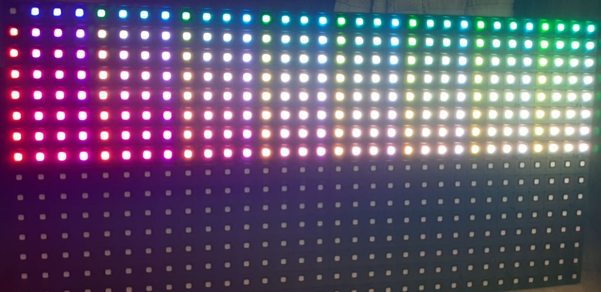
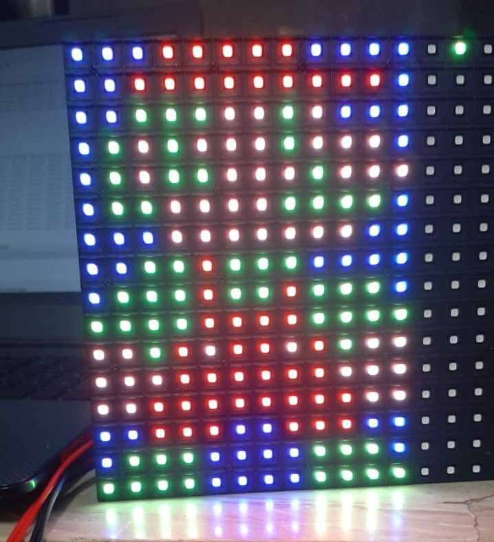
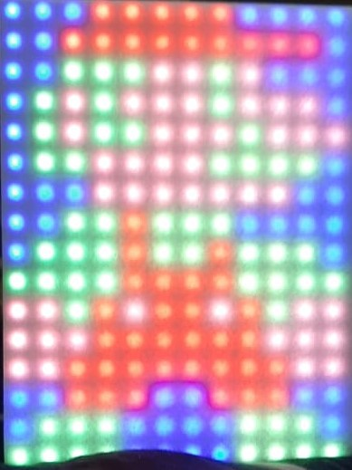
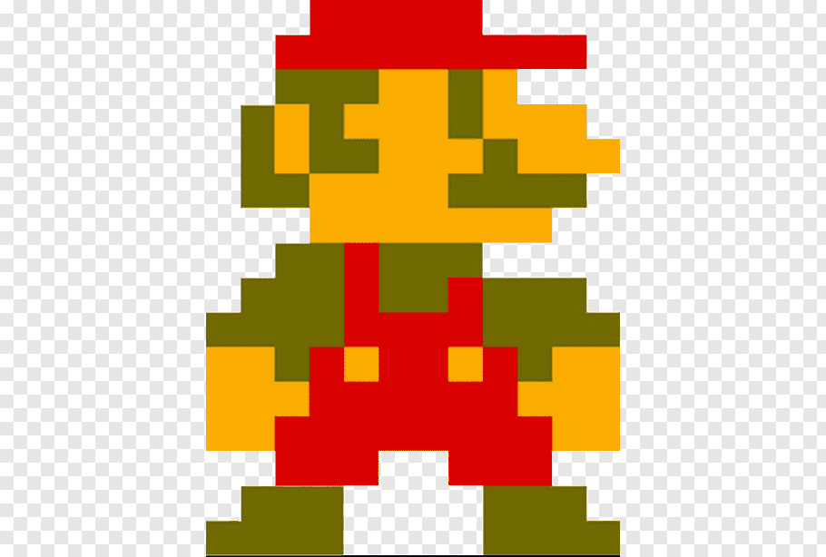

# RGB-Led-Panel
This project is about using a 3-bit rgb led panel to display images with higher colour depth and creating a GFX library for it.

## Setup

Here, I'm using stm32f103c8t6 microcontroller because it has 72 MHz internal clock and about the same speed for the eternal GPIOs. This is required for fast refresh rate of the led panel which we will require to display 12 bit colour. (You can probably go higher than that but I'll stop at 12 bit colour)

Because the stm32f103c8xx is 3.3v, we have to convert that to 5.0v for the rgb led panel. To do that, I used a 3.3v to 5v logic level converter. For now however I've used a couple of buffers and AND gates because of the coronavirus lockdown in my country.

I won't show the connections of microcontroller to the panel because the pinout can vary depending upon the manufacturer. I had to reverse engineer mine to know its connections.

## Technique

Now we discuss how to display 12-bit colour on a 3-bit display. *(BTW by 3-bit I mean that the display can display only 8 colours black, white, red, blue, green, cyan, magenta, orange by default)* 

This is most probably not a new thing but what we are going to do use use sort of PWM techniques to switch LEDs on and off some percentage of the time to so that it appears dimmer. We can do that if we connect an LED to one of the PWM outputs of an arduino and run a PWM signal though it, with that by just changing the percentage of the time the LED is switched on, if we do it fast enough, the LED would appear dim to us. We are going to use the same technique here.

We cannot use the PWM output directly, so we will use an internal clock which will call the display function every fixed period of time. In my case, I've set it to run ever 200 micro seconds. Meaning we have a 5000Hz display. Now some may be thinking this is completely unnecessary, and you're probably right. But I did this anyways and it works. I also checked the datasheet of the rgb led panel andfound that it can support higher refresh rates than that.

The format of a 12-bit color system that I've used here is **RRRR GGGG BBBB** (Where every character is a bit corresponding to it's color). From this we can tell that every color has 4-bit of data meaning there can be 16 brightness levels of a single colour. So we set a cycle with the value 16.

Let's take an example for a pixel where we want to display the colour **0011 1000 1011** : 

Cycle step | Red | Green | Blue
----------|-----|-------|------
1 | HIGH | HIGH | HIGH |
2 | HIGH | HIGH | HIGH |
3 | HIGH | HIGH | HIGH |
4 | LOW | HIGH | HIGH |
5 | LOW | HIGH | HIGH |
6 | LOW | HIGH | HIGH |
7 | LOW |  HIGH | HIGH |
8 | LOW | HIGH | HIGH |
9 | LOW | LOW | HIGH |
10 | LOW | LOW | HIGH |
11 | LOW | LOW | HIGH |
12 | LOW | LOW | LOW |
13 | LOW | LOW | LOW |
14 | LOW | LOW | LOW |
15 | LOW | LOW | LOW |

The table above is one cycle. This will be done contiuously. Also to be noted that this is only for the color code given above.

## Result

This image represent 8-bit color with 256 total colors. I didn't display 12-bit colour here because there are 4096 total possible colours in 12-bit colour and the panel doesn't have that many pixels.

Here I've displayed Super Mario in 12-bit color but I don't think you can see it that well so I wanted to add a diffuser but as I cannot leave my house (Due to Coronavirus Lockdown), I used a sheet of paper instead.

## End Note
I don't think I explained how this works that well here so would probably give a much better explaination later along with better photos and a diffuser.
